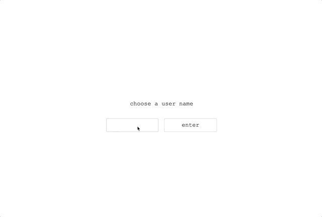

# Elm message board

This is a simple client server application of a message board. The frontend is developed with Elm, the backend is a simple Python Flask server.

# How to run

1. Start the server with `python server.py`
2. Start the frontend with `elm reactor`
3. Browse to `http://localhost:8000`

# How it looks

